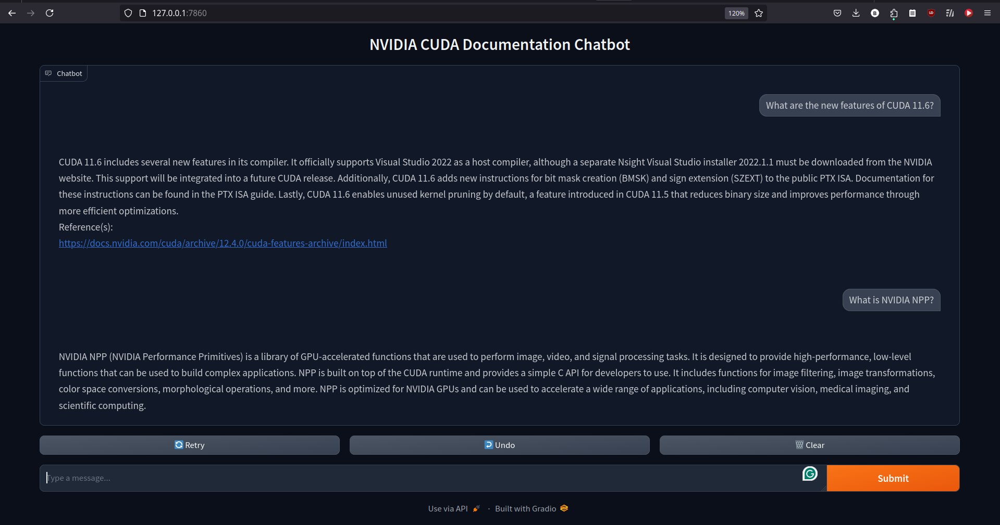

# RAG Chatbot for NVIDIA CUDA Documentation Site

#### Working screenshot:

#### Info:
* The data is sourced from https://docs.nvidia.com/cuda/, scraped up to 5 levels of sub-link depth using Scrapy and is processed and cleaned.
* The scraped data was chunked using semantic chunking via Langchain and embedded with HuggingFace's [sentence-transformers/all-mpnet-base-v2](https://huggingface.co/sentence-transformers/all-mpnet-base-v2). 
* The data alongside metadata is stored using MILVUS with HNSW indexing in a Zilliz cloud cluster.
* BGE-M3 colbert+sparse+dense re-ranking pipeline via HF inference API is used to re-rank MILVUS vector search results. Local hybrid BGE-M3 re-ranking is ideal but was not chosen due to computing limitations causing high latency.
* [Mixtral-8x7B-Instruct-v0.1](https://huggingface.co/mistralai/Mixtral-8x7B-Instruct-v0.1) LLM via the HF inference API is being used for chat. Ideally, a larger and locally hosted model should yield the best performance, but computing limitations.
* Gradio is being used for the user interface.

#### Instructions to run the demo:
1. `pip install -r requirements.txt`
2. Set up your MILVUS account and modify the Milvus client code according to your set-up - (different for docker, zilliz, etc.) in main.ipynb to upload the data.
3. Set up HUGGINGFACE_TOKEN env variable in .env file for BGE-M3 and Mixtral usage via inference API.
4. Run the gradio_app.py via `gradio_app.py` to access the user interface. Alternatively, you can run the code at the end of the main.ipynb.
5. Please feel free to reach out to me at `bharathrajpalivela@gmail.com` in case of any queries.
